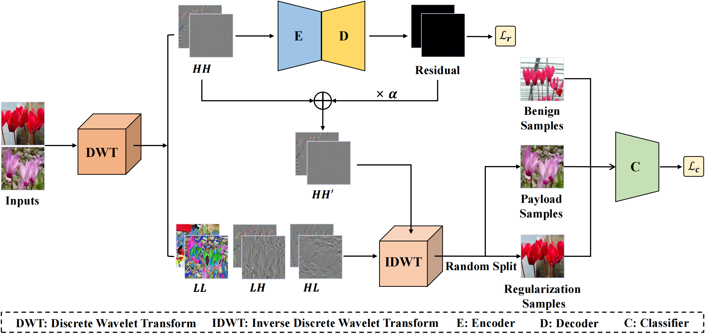

# WaveAttack: Asymmetric Frequency Obfuscation-based Backdoor Attacks Against Deep Neural Networks

## Introduction

This repository includes the PyTorch implementation for our paper 
"WaveAttack: Asymmetric Frequency Obfuscation-based Backdoor Attacks Against Deep Neural Networks".

[2024.11.01] Coming soon.